# Pedro Rocha

Data Engineer | Python • SQL • Airflow • Spark

Building reliable data pipelines and modern data platforms.

📍 Rio de Janeiro, Brazil

---

## About me

Data Engineer focused on building scalable data pipelines,
ETL/ELT workflows and data platforms.

Currently working with:

- Python
- SQL
- Apache Airflow
- Apache Spark
- Docker
- Power BI
- PostgreSQL / SQL Server
- Data Lakes & Lakehouse architectures

Currently exploring:
- Apache Iceberg / Delta Lake
- MinIO / Object Storage
- Cloud Data Engineering
- Data Architecture
---

## Featured Projects

🎲 Board Games Lakehouse
API → Data Lake → Medallion → Spark → Airflow → BI

🎵 Music Data Pipeline
API → Airflow → PostgreSQL → Analytics

🌦️ Weather Data Pipeline
API → ETL → PostgreSQL → Airflow

---

## Tech Stack

  
  
  
  
  

---

## GitHub Stats

  
  

---

LinkedIn (https://www.linkedin.com/in/pedro-rocha-de-jesus-286b481a1/) | Email (pedrorochadejesus.70@gmail.com)
